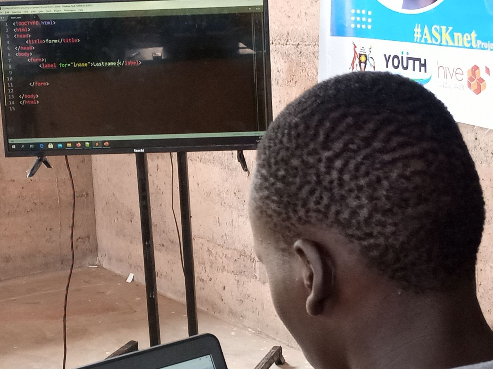
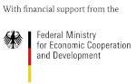

# Title:Digital-Tech-Boot-Camp-Report-2021-2022

Digital Tech Boot  Camp is an initiative and training opportunity for young people with **basic computer knowledge to learn  programming languages and built products to solve local challenges** .And also to fully understand the functionalities of knowledge sharing,such as **soft wares/applications like github,build websites for information sharing** .All successful trainees shall become mentors to thers who shall be recruited to expand the network of **ASKnet** peers."**Accelerating access to info and community collaboration/co-creation for innovation**.
 

# Actual location of implementation

Pagirinya 2 refugee camp in northern uganda.

For the location of open >>> [pagerinya 2](https://mapcarta.com/N4344411401/Map)

# Actual implementation period

**3** months.

# Actual target population

The training **targeted 10**,But we **recruited 9 trainees** from pagirinya,**4 females**,**5 males**.
**50%** of them took part in the previous training and the rest were new to the program.
Of the **5 trainees** from the previous training program,**2** were male and **3** were female.

we shall continue mentoring the trainees to perfect skills which will be employed in the satelite HUB to advance media projects,which will generate incomes for and guide them in pursuing their career.

***The Youth Empowerment Foundation jointly implemented with pagirinya satelite Hub***.

# Contact data

## Names,positions,Emails

Mr Vuga William,ED,Vugawilly@gmail.com

Mr Ira Emmanuel,Programs Manager,iraemman@gmail.com

## The overall project assessment

The boot camp started with an orientaion of the participants to the program as a kick off to the training, this was followed by one week basic computer skills assessed by the lead trainer.
    

In the third week,they were introduced to coding basics and web development which lasted five weeks

In the eighth week, they covered the introduction to Git and GitHub use by Hakim from Carlton University in form of a workshop which was done virtually. 

In the ninth week, workshop II was conducted in-person to train the participants in GitHub uses.

The trainees learned to create Repositories, fork, create files in GitHub repository, commit changes in GitHub, GitHub issues, pull requests, merge pull requests, Branches, markdown files. 

The trainees demonstrated the ability to comfortably use GitHub as a collaborating software for knowledge sharing, they used it to document the web development training guide to make it accessible to the community.

In the tenth week, the lead trainer started the basics of web design which was covered up to week eight.
 

In the Eleventh week, another expert **KasiryeLabs** was invited for **3 days of hands-on training on WordPress** ,**web development and content management**.
  

The areas covered in the website included; ***content management system***, ***local installation of WordPress***, ***local servers i.e. using Xamp as a local server***, ***troubleshooting websites***, ***introduction to page builders*** e.g. **elementor**, **introduction to themes and plugins**, and **web content strategies**. 
 
 The participants teamed up to build the **RefugeeConnect website**, an information platform that publishes content about refugees and ***makes access to information easy for them***.

# Overall impacts of the project
  
## short- term
  
  - The trainees learned to *create Repositories*, *fork*, *create files in GitHub repository*, *commit changes in GitHub*, *GitHub issues*, *pull requests*, *merge pull requests*, *Branches*, *markdown files*.
   
   - The project has overall archived its objectives, the participants were able to gain knowledge and practiced by developing a website **RefugeeConnect** not hosted online yet, they also learned **content creation and publication**.
  
  - The trainees demonstrated the ability to comfortably use GitHub as a collaborating software for knowledge sharing, they used it to document the web development training guide to make it accessible to the refugees.
     
  
  - The areas covered in the website included; *content management system*, *local installation of WordPress*, *local servers* e.g *using Xampp as a local server*, *troubleshooting websites*, *introduction to page builders* e.g. *elementor*, *introduction to themes and plugins*, and web *content strategies*. 
    

# long-term
  
  - The project has strengthened the relationship between the organisation and the host community,In the way that continuation of it will lead to rteduction of the alarming number of school dropout within the settlement which will improve their livelihood.
  
  - capacity building ,the trained participants are now able to solve media related technicalities by themselves,And they are dispersing the skills to the ones who are yet to be recruited.

# Achievements
  
  - The project improved the skills of participants in the use of basic computer applications and internet use. 
    
    
  
  - The trainer possessed the necessary skills to train, we also invited experts to conduct workshops and the participants demonstrated a willingness to learn.
  
  - Some participants were slow to learn; they were given more time to practice which slowed down the training progress ,but  however,we managed to meet the schedule by teaming them up through peer-to-peer learning sessions. 
  
  - The peer-to-peer teaming up has helped the participants to develop working together and sharing skills.
    
    
  
  - The boot camp training was planned to have 10 participants, however, we enrolled 9 participants due to a shortage of computers for use. We had 6 computers and 3 of the participants came with their own. 
  
  - The project has overall archived its objectives, the participants were able to gain knowledge and practiced by developing website ***RefugeeConnect*** not hosted online yet, they also learned ***content creation and publication on the websites***, this has helped them understand much better the ***origin of information online***. Thus ,it made them understand how ***media*** works.
    
    
  
  - They also acquired skills in the use of ***documentation/ collaborating software GitHub to share knowledge and collaborate*** in creating respository/projects.
    
    
  
# Challenges
  
  - Some participants were slow to learn; they were ***given more time to practice which slowed down the training progress*** ,but  however,we managed to meet the schedule by teaming them up through peer-to-peer learning sessions.
  
  - Most of the trainees had limited exposure to computers ***(Majority do not own computers)***, this slowed the training ***progress***, we also underestimated the costs for ***expert fee***, hence we couldn’t afford to ***hire one for App development***. 
   
  - The boot camp training was planned to have ***10 participants***, however, we ***enrolled 9 participants*** due to a ***shortage of computers*** for use. We had ***6 computers*** and ***3 of the participants came with their own***.
  
  - There was aproblem of ***power***,due to ***hiking of fuel prices***, It has been a great challenge as working hours reduced with an aim of utilizing the little budget for fuel.
  
  - The ***training gadgets*** were not enough for participants for example ***computers***.

# Sustainability
  
  - The participants have formed a network of experts on web development and we are willing to facilitate them with ***computers***,***power***,***space*** and ***market*** them to the ***business entities*** and ***other community based organizations to build them websites***. The website they built ***Refugeeconnect*** will generate them through ***adverts*** to keep it running by host fee renewal.
  
# Public Relations
   
   
https://yef-uganda.org/
https://www.facebook.com/1415857448508218/posts/4472635199497079/
https://www.facebook.com/1415857448508218/posts/4579757528784845/
https://www.facebook.com/1415857448508218/posts/4545903232170275/

# partners and funder

There are three partners and one funder involved in this great project,these are:

**r0g** (agency for critical transformation and development) which is a lobbying partner, lobbying financial support from the funder."**Who are they**"? 

**r0g_open_culture**

The r0g _agency (pronounced: rogue) is a Berlin-based nonprofit dedicated to partnering with local grassroots organizations and governments to support open knowledge, open technology, and peacebuilding efforts in the Global South, particularly those regions undergoing rapid and fundamental transformation, in order to support the development of healthy, peaceful societies.

The word ‘open’ is borrowed from the tech world and is used to describe something (texts, software, technology, information) that is accessible by the general public, and is free to be used and redistributed without legal or technological restrictions, removing barriers that might otherwise stand between individuals and the information they need

**ASKnet** (Access to skills and knowledge network). "**who is ASKnet**"?

**ASKnet** is a network of hubs and community members who subscribe to the vision of;

**Educating on media literacy**.
**Creating communities with hands on experience while providing open access to skills and knowledge** that can **impact a community using the available resources**

So **ASKnet** has projects ready,look for funding through **r0g** and pass them to implementing partners like in this case **YEF**.

**YEF** (The Youth Empowerment Foundation) the implementing partner located in pagirinya refugee camp in northern Uganda. 

"**Who is YEF**"?

The Youth Empowerment Foundation Uganda is **a community based organisation that aims to mobilise and support young people in refugees and host communities** .

"**We equip the youth with relevant media skills to promote freedom of expression and widen access to information while educating young people on media literacy**".

**BMz** (Federal ministry of economic cooperation and development) in Germany,this is the funder of the great project bringing great changes and smiles in the faces of refugee Youths who are benefiting from it.

For more information on the partners and funder,click on the link to their official websites bellow.

|BMZ  |r0g agency|ASKnet| YEF |
|:----:|:-------:|:-----|:----:|
|||||
|[Official website](https://www.bmz.de/en)|[Official website](https://openculture.agency/)|[Official website](https://github.com/ASKnet-Open-Training)|[Official website](https://yef-uganda.org/)|

# Other remarks
  
  - **The Youth Empowerment Foundation** **(YEF)** applauds **r0g**-**(agency for critical transformation and development)** for lobbying for such a great opportunity. **YEF** was able to **train 9** participants to become **(Trainer of trainees)** **TOT** to led in the community as experts, and provide **capacity building**. We are very grateful for the **partnership** and are **optimistic** for more opportunities to work together in the development of **media and Technology** in the refugee settlement. 
  
